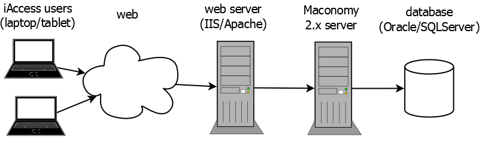

# Architecture

Briefly described, iAccess for Maconomy is an HTML5 web client. It is a lightweight user interface supplement to the existing Workspace Client. The backend is Maconomy, specifically the new RESTful web services exposed from Maconomy since version 2.2. In this section, we will give a cursory overview of the technical architecture.

## Technical Architecture

Figure @architecture shows the high-level architecture of a Maconomy system with iAccess. This setup resembles the traditional Maconomy architecture with a few exceptions. In the following section, we will describe the core components involved and the purpose of each of those.

Maconomy 2.x server and database
: iAccess for Maconomy is available from Maconomy 2.2. It does not impose any specific requirements on the database, but it does require a Maconomy 2.2 server and corresponding RESTful API [@RestAPI]. See the [following section](#restful-web-service-api) for more details on the required web services.

Web server (IIS/Apache)
: One or more web servers are required to serve both the static and dynamic content of iAccess. Static content such as HTML, JavaScript, CSS files, and so on are placed directly on the web server. Dynamic content such as specifications, files, and data are retrieved from the Maconomy server, but the web server in this case acts as proxy. Using the web server as proxy prevents cross-origin (CORS) issues on the client side. The web server is also required for encryption and compression of client-web server communication.

iAccess Clients
: The iAccess clients can be located both on the internal network or on the open Internet depending on the web server configuration and exposure. Furthermore, clients can run iAccess on different devices such as laptops with the main browsers (IE, Chrome, and Safari), as well as on iOS and Android tablets.

### RESTful Web Service API

As mentioned previously, iAccess for Maconomy uses the RESTful Web Service API which was introduced in Maconomy 2.2. This is _not_ the same thing as the existing MScript web services. Please see the RESTful Web Services documentation for more information [@RestAPI]. For now, we will just briefly list the web service endpoints that iAccess uses and what they are used for:

/containers
: The *containers* endpoint delivers both metadata and data for the containers exposed by the Maconomy 2x server. Metadata include specifications of the names, actions, fields, and  foreign keys exposed by different containers. Data include the actual filter-, card-, and table-data stored in the underlying database as well as information on which actions are enabled.

/filedrop
: The *filedrop* endpoint is used to upload files such as receipt attachments on expense sheets.

/configurations
: The *configurations* endpoint was introduced in Maconomy 2.2.2 and is used by iAccess 1.2 and onwards. This endpoint is used to retrieve JSON specifications from the Maconomy server, specifically the application specification (`application.json`) which configures iAccess. These specifications are the foundation of the iAccess extensibility model.

/auth
: The *auth* endpoint was introduced in Maconomy 2.2.4 and 2.3GA, and is used by iAccess 2 and onwards. This endpoint is used to obtain login tokens for 3rd party integrations such as Business Objects.

/environment
: The *environment* endpoint was introduced in Maconomy 2.2.5 and 2.3GA and is used by iAccess 2 and onwards. This endpoint is used to retrieve the end-user's environment variable, e.g., employee name and number, company info etc.
