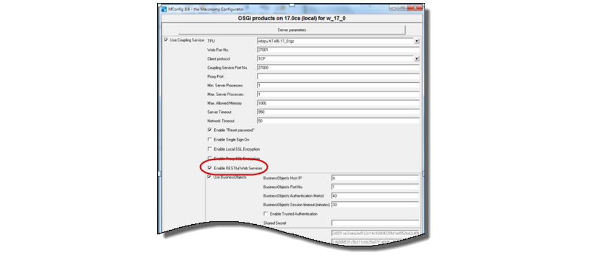
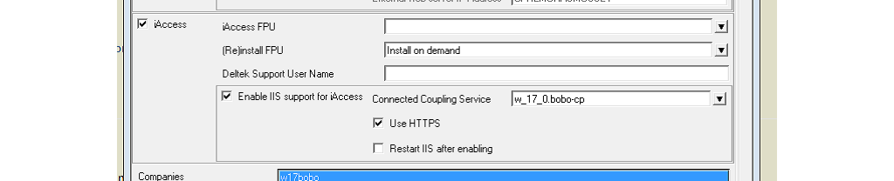
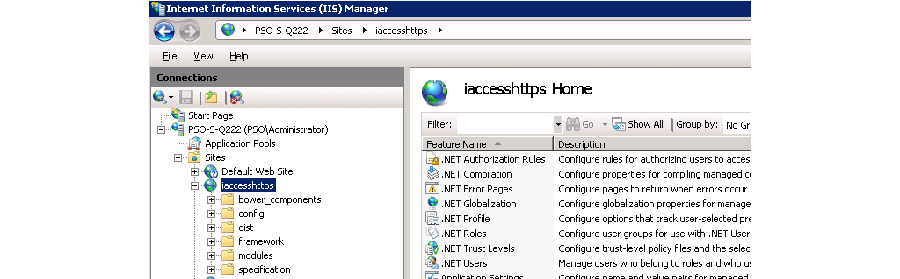
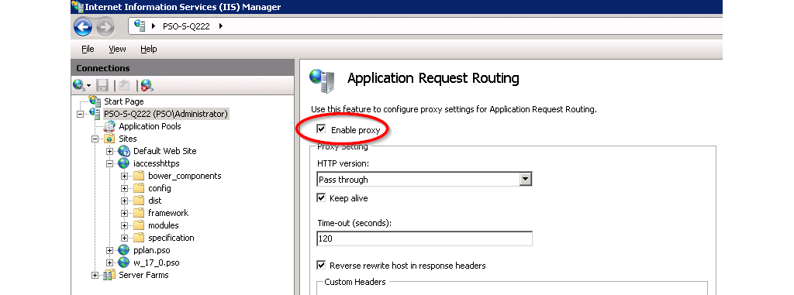
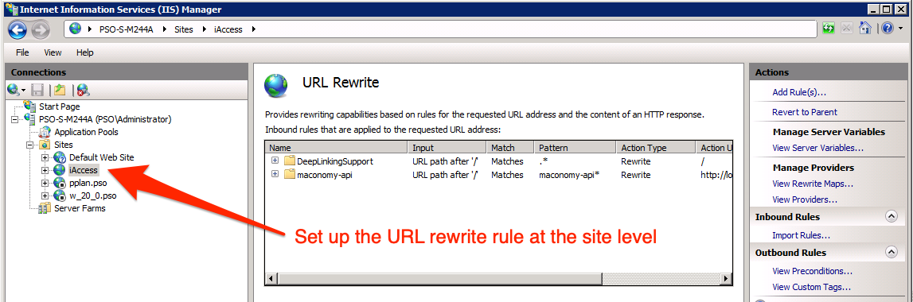
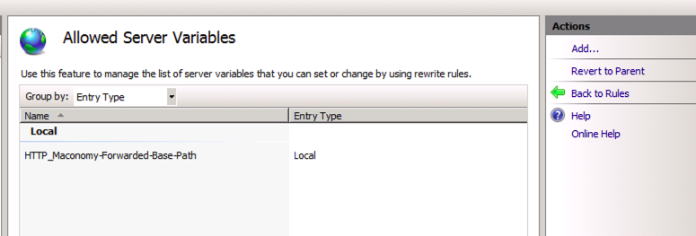
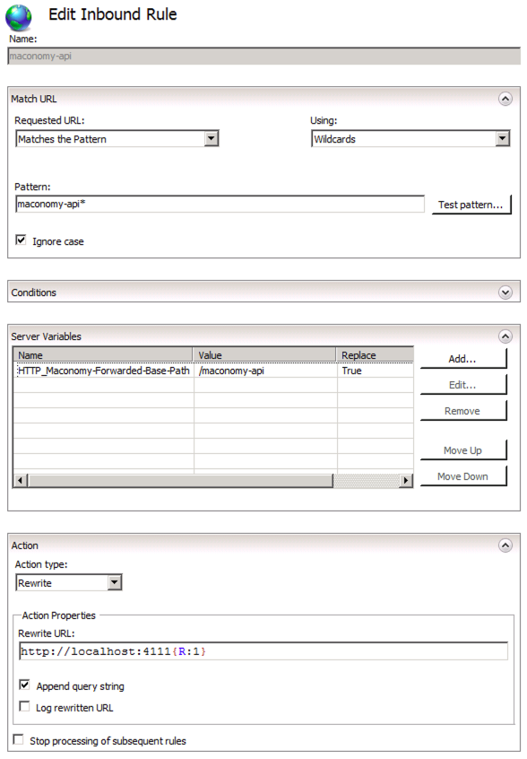
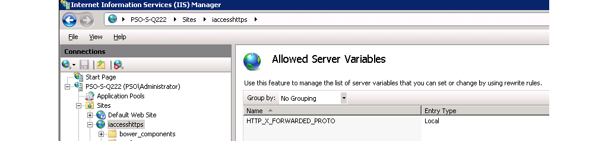
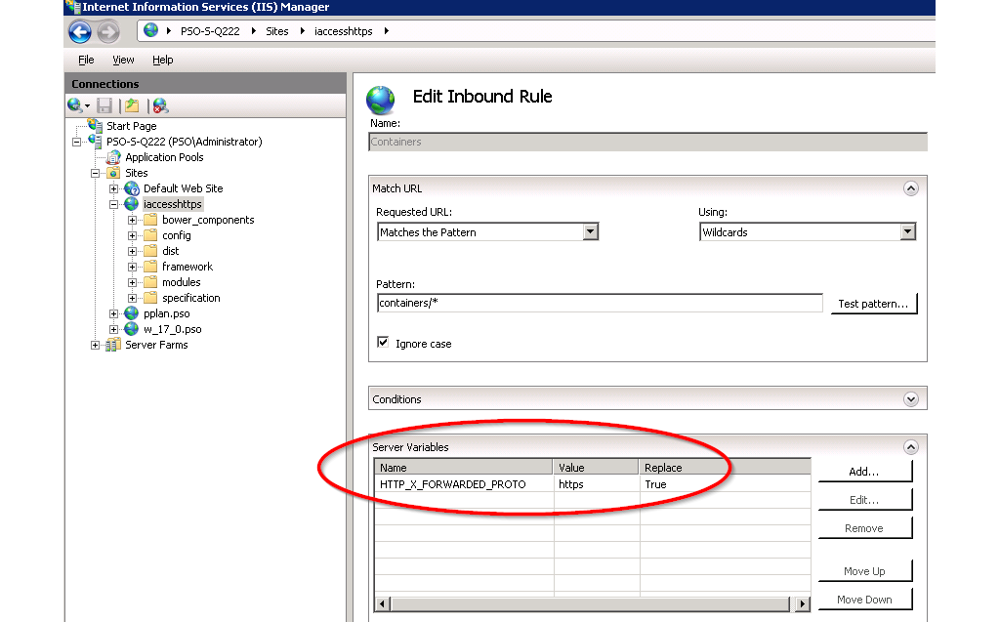

# Installation

This section describes the installation process for iAccess. Keep in mind that parts of the installation process (in particular, web server configuration) are specific to the individual installation. As such, this section can only offer general guidelines. In case of doubt, we recommend posting a question on our iAccess Kona Space.

## The iAccess Manifest

To install iAccess, you need an installation of Maconomy and a suitable version of MConfig. The iAccess product is packaged in an archive file format called an FPU (*Flexible Packaging Unit*). An FPU contains the following components:

1. The Tools part which is a set of JavaScript, HTML and CSS files responsible for executing the iAccess Applications in the browser.
2. The embedded iAccess Applications each consisting of a set of JSON files describing workspaces, layouts, and other settings for iAccess against a particular range of Maconomy backends
3. The FPU manifest (`manifest.json`) which specifies various metadata about the FPU such as version info and compatibility constraints.

The required backend Maconomy version for a given iAccess is documented in the release notes for each iAccess release. You can also inspect the `manifest.json` file mentioned above. In the following `manifest.json` sample, we can see that this iAccess FPU is of version 2.0.5. The applications section lists the core Maconomy versions that this version of iAccess is compatible with. In this case, it is compatible with specifics service packs on 2.2 (internally called `17`), 2.3 (internally called `19`), and 20 (internally called `20`). Below, the metadata for the 2.2/17 application is expanded and it can be seen that iAccess 2.0.5 is specifically only compatible with service pack 5 of Maconomy 2.2 (internally called `17.0.105`).

    {
      "manifest-version": 3,
      "marketingVersion": "iAccess for Maconomy 2.0",
      "fpuVersion": "2.0.5",
      "apiVersion": "8.0.0",
      "applications": {
        "17": {
          "requires": "^1.0.0",
          "src": "...",
          "backends": [
            {
              "tpu": { "versionRange": "17.0.105" },
              "apu": { "versionRange": "17.0.105" }
            }
          ]
        },
        "19": { ... },
        "20": { ... }
      }
    }

Once the Maconomy system is installed and configured, MConfig can install the iAccess FPU on a web server of choice. MConfig will also install an iAccess Application matching the Maconomy backend on the Maconomy server, specifically in the `Web` folder in `MaconomyDir`. We currently support IIS and Apache (see release notes for the specific version requirements for these web server products). On the web server, you should also set up a web site with the installed iAccess `index.html` in the root. Once the MConfig installation has taken place, and the web site and proxy settings have been completed, iAccess is ready. Please observe that certain manual steps may be required for specific installations.

## Security Considerations

While Deltek recommends the following procedures, ultimately each company is liable for its own security. The landscape evolves quickly, and each customer should continuously take internal measures to ensure its own security.

### Regarding the use of HTTPS/TLS

Deltek best practice recommends that you configure web servers to use HTTPS (instead of HTTP). Using HTTPS/TLS encrypts your network traffic, making it difficult for anyone to access the credentials as they are passed to the web server. Using simple HTTP is tantamount to sending confidential information over the wire in clear text. The iAccess login page will display a warning message in case HTTP is used instead of HTTPS.

### Address Risk of Clickjacking

To reduce the likelihood of clickjacking, Deltek suggests you follow the OWASP guidelines to defend against clickjacking attacks. Based on the OWASP guideline, you can perform additional steps when configuring your webserver. See [Additional Related Procedures](#additional-related-procedures) for more details.

## Prerequisites

The following are prerequisites to installing iAccess:

* Maconomy 2.4.3
* MConfig 8.18
* Extender 1.8.2
* RESTful Web Services is enabled in the Coupling Service
* iAccess downloaded from DSM, and iAccess FPU placed in the PUs folder (with the APU and TPU)
* If you are using Apache as the webserver, download the Apache binary package including OpenSSL, and install it from the following link:
  http://httpd.apache.org/
* Standard extensions are already installed

Additionally, this document assumes that you have already set up an application. For detailed instructions on setting up applications, see the Deltek Maconomy Installation Guide for your specific Maconomy version.

## MConfig Installation

To begin installation with MConfig, complete the following steps:

Step 1
: In the MConfig Main Window, double-click the application to open. The Application Instance window displays as shown in Figure @mconfig1.

Step 2
: Click OSGi products. The OSGi Server Selection screen appears as shown in Figure @mconfig2.

Step 3
: Select the Coupling Service to update as shown in Figure @mconfig3.

Step 4
: Select the Enable RESTful Web Services check box as shown in Figure @mconfig4.

Step 5
: Click OK to save, and click OK at the SSL warning to return to the Application Instance
window. In the Application Instance window, click Web products as shown in Figure @mconfig5.

Note: While you can click OK at the SSL warning, Deltek recommends you follow the steps listed in the warning to ensure the security of your system.

Step 6
: On the Web server selection screen, select the application to update. Select the iAccess check box as shown Figure @mconfig6. In the iAccess FPU field, select the relevant FPU from the drop-down list.

Step 7
: Click Ok a couple of times to return to the main window, and click Next a couple of times, and then click Yes to complete the MConfig installation.

## Create a Website Using IIS

To create a website using IIS, you can enable IIS support automatically using MConfig, or perform the steps manually using IIS Manager.

Enabling IIS support with MConfig automatically completes the steps described under the manual installation. Use MConfig for the initial setup of an iAccess website using IIS. However, modifying the setup later should be done manually using IIS Manager.

### Enable IIS Support Automatically Using MConfig

Automatic IIS configuration requires MConfig 8.12.4. Previous version will not perform a correct configuration of IIS due to a shortcoming in MConfig. To enable IIS support using MConfig, follow these steps (See Figure @iis-mconfig):

1. In MConfig, go to the Web Products window.
2. Select the Enable IIS support for iAccess check box and click OK.

Note: After you complete the initial installation with MConfig, you should check the setup in IIS Manager and possibly modify parameters, such as Web Server Port Number.

Note: If you enable IIS support automatically, MConfig also updates the IIS web.xml file with a routing rule that ensures login pages and other non-root URLs load properly.

### Enable IIS Support Manually Using IIS Manager

After iAccess has been installed on your IIS web server, you can configure it using IIS Manager.

#### Add the Site
: Connect to your server in the Internet Information Services (IIS) Manager application and setup the iAccess site. The site should have the files shown in Figure @iis1 as root files.

#### Add MIME Types
: Click the "MIME Types" and ensure that the MIME Types below are defined

    .json application/json
    .woff application/font-woff
    .woff2 application/font-woff

 In IIS 8.0 and up, the .woff extension exists by default but with a different type. Change it to *application/font-woff*.

#### Proxy Setup

1. Install Microsoft Application Request Routing for IIS [ARR](http://www.microsoft.com/en-us/download/details.aspx?id=39715).
2. Restart IIS Manager.
3. In the *Application Request Routing* configuration, click *server proxy settings*.
4. Check *Enable proxy* as shown in Figure @iis2.
5. Open *URL Rewrite* to add proxy rules for the container, configurations and filedrop APIs. Note: This must be done on the local site, not globally as shown in Figure @iis3.

In IIS 8.0 and up, you will need to install the [Web Platform Installer](https://www.microsoft.com/web/downloads/platform.aspx) in order to install the ARR plugin.

##### Edit Routing Rules

To ensure that login pages (and other non-root URLs) load properly, open the IIS web.xml file and add the following rule *before* the other routing rules:

    <rule name="DeepLinkingSupport" stopProcessing="false">
      <match url=".*" />
        <conditions logicalGrouping="MatchAll" trackAllCaptures="false">
          <add input="{REQUEST_FILENAME}" matchType="IsFile" negate="true" />
          <add input="{REQUEST_FILENAME}" matchType="IsDirectory" negate="true" />
          <add input="{REQUEST_FILENAME}" pattern="maconomy-api*" negate="true" /> 
        </conditions>
      <action type="Rewrite" url="/" />
    </rule>

Note: If you want to install iAccess in an *IIS Application folder*, you should update the **rewrite** action accordingly.

For example, if the *IIS Application folder* is called **iAccess", then the rewrite action should be:

    <action type="Rewrite" url="/iAccess/" />

##### Add the server variable for Maconomy API

1. Click View Server Variables
2. Click Add...
3. Set the name: HTTP_Maconomy-Forwarded-Base-Path

##### Set up proxy for Maconomy API

1. Click Add Rule...
2. Select Blank rule.
3. Fill out the rule as shown in the section on setting up proxy for Maconomy API, specifically with the following parameters:

Match URL

    Requested URL: Matches the Pattern
    Using: Wildcards
    Pattern: maconomy-api*
    Ignore case: checked

Server Variables

	Click Add...
	Server variable name: HTTP_Maconomy-Forwarded-Base-Path
	Value: maconomy-api

Action

    Action type: Rewrite
    Rewrite URL: http://<coupling-service-host>:<coupling-service-port>{R:1}
    Append query string: checked

##### Preserve the Host Header

Open a console with Administrative privileges, and navigate to

    C:\Windows\System32\inetsrv

Enable preserveHostHeader by running the following command:

    cd C:\Windows\System32\inetsrv
    appcmd.exe set config -section:system.webServer/proxy /preserveHostHeader:"True" /commit:apphost

Note: To preserve the spacing, copy the command and paste it in the command prompt.

Restart the web server.

See [*AppCmd* reference](http://www.iis.net/learn/get-started/getting-started-with-iis/getting-started-with-appcmdexe) for more details.

### Set Up HTTPS

Open the Server Variables screen by clicking *View Server Variables...* in the *URL Rewrite* screen.

In the Server Variables screen, click *Add...* and add the variable `HTTP_X_FORWARDED_PROTO` as shown in Figure @iis6.

In the URL rewrite rules (both containers, configurations, filedrop, auth, and environment) that proxies the web service, set the server variable `HTTP_X_FORWARDED_PROTO` to `https` as shown in Figure @iis7.

Restart the webserver.

Note: It is not possible to run both HTTP and HTTPS on the same IIS site.

## Create a Website Using Apache

Here is a short guide to setting up iAccess on Apache (2.2 and 2.4)

### Download Apache

Download the Apache 2.2 binary package including OpenSSL. Install it.

In `httpd.conf`, comment in the following modules:

    LoadModule headers_module modules/mod_headers.so
    LoadModule proxy_module modules/mod_proxy.so
    LoadModule proxy_http_module modules/mod_proxy_http.so
    LoadModule ssl_module modules/mod_ssl.so
    LoadModule rewrite_module modules/mod_rewrite.so

Comment in the inclusion: `Include conf/extra/httpd-vhosts.conf`

Comment out `#Listen 80` (we will use the `httpd-vhosts.conf` file instead)

### Enable compression

If using Apache 2.2, comment in the following module: `LoadModule deflate_module modules/mod_deflate.so`

If using Apache 2.4, use this module: `LoadModule filter_module modules/mod_filter.so`

Configure the compression:

    <IfModule deflate_module>
      AddOutputFilterByType DEFLATE text/html text/plain text/xml text/css text/javascript   application/javascript
      SetOutputFilter DEFLATE
      DeflateCompressionLevel 5
    </IfModule>

See [Apache Deflation Module](https://httpd.apache.org/docs/2.2/mod/mod_deflate.html) for more information.

### Setup with SSL

Here is a template for setting up a virtual host that serves iAccess _with_ SSL. Copy contents into the `httpd-vhosts.conf` file, and replace the variables with the desired values. Please observe that the line `Require all granted` below is only required for Apache 2.4.

    Listen <port>
    <VirtualHost *:<port>>
        ServerName <server-name>

        # Server iAccess files from installation directory
        DocumentRoot "<iAccess-installation-directory>"

        <Directory <iAccess-installation-directory>>
           Order deny,allow
           Allow from all
           AllowOverride All
           Require all granted
        </Directory>

        <Proxy *>
           Order deny,allow
           Allow from all
        </Proxy>

        ProxyRequests      Off
        ProxyPreserveHost  On
        
        RequestHeader set Maconomy-Forwarded-Base-Path maconomy-api
        # Signal to the coupling service that the originating protocol is HTTPS
        RequestHeader set X-Forwarded-Proto "https"        
        
        # Proxy the web services from the coupling service
        ProxyPass  /maconomy-api  http://<coupling-service-host>:<coupling-service-web-port>  retry=0

        # Set up this virtual host to use SSL
        SSLEngine              On
        SSLProxyEngine         On
        SSLCertificateFile     <crt-file-location>
        SSLCertificateKeyFile  <key-file-location>
    </VirtualHost>

### Edit Routing Rules

For more information, refer to [Edit Routing Rules](#edit-routing-rules) under the [Enable IIS Support Manually Using IIS Manager](#enable-iis-support-manually-using-iis-manager) section.

### Verifying the setup

To quickly verify the setup, open a browser (such as Chrome) and navigate to the following URL:

    https://<external-url-and-port>/containers/v1/<shortname>

For example:

    https://acme.com/containers/v1/w20sp100

If the proxy configuration is correct, the browser should either download, or show an XML or JSON document that looks like the following:

    <Endpoint xmlns="http://www.deltek.com/ns/webservices" shortname="m20sp100" authenticated="false">
      <Versions>
        <TPU major="20" minor="0" sp="100" fix="0" beta=""/>
        <APU major="20" minor="0" patch="100" hotfix=""/>
      </Versions>
      <Languages> ... </Languages>
      ...
      <Links>
        <Link href="https://acme.com/containers/v1/w20sp100" rel="self"/>
      </Links>
    </Endpoint>

## Domain Login and Single Sign On

The domain login functionality in iAccess is based on Kerberos service tickets obtained through
the SPNEGO authentication protocol. This protocol allows direct Single Sign On (SSO) when
the user is running iAccess while already authenticated against the domain (that is, logged in
to their computer via a domain account).

If the user is not authenticated against the domain, the browser typically prompts for domain
credentials. Click __Cancel__ in the browser login window and use the iAccess domain login page.

### Browser Setup for Single Sign On

Refer to the instructions in this section to set up Single Sign On (SSO) for various browsers.

#### SSO Setup for Internet Explorer

For Internet Explorer (IE), you may need to add the iAccess server address to the Local intranet zone if it is not already in this zone, as IE does not permit Kerberos-based SSO for websites in the Internet zone.

More details are available in the "Client Side-Internet Explorer" section of the following Microsoft article about security zones in Internet Explorer:

    https://msdn.microsoft.com/en-us/library/ms995329.aspx

#### SSO Setup for Chrome

You can choose one of two options:

* If using Windows, you can perform the setup required for Internet Explorer. Chrome can replicate the setup for IE.
* To configure Chrome to work with SSO using Kerberos authentication, follow the steps in the "Set Chrome policies for devices" guide (https://support.google.com/chrome/a/answer/187202?hl=en).

The configurations should be done by IT administrators who want to set Chrome policies on their
corporate-managed devices. The templates contain hundreds of available policies that can be
set, but you should only focus on two of these, namely:

__AuthNegotiateDelegateWhitelist__ ( http://www.chromium.org/administrators/policy-list-
3#AuthNegotiateDelegateWhitelist )

and

__AuthServerWhitelist__ ( http://www.chromium.org/administrators/policy-list-3#AuthServerWhitelist ).

The properties should be set to the domain you want to authenticate against, such as:

    "*. example.com ".

#### SSO Setup for Chrome on Windows

After following the preceding guide from Google, you can set __AuthNegotiateDelegateWhitelist__ and
__AuthServerWhitelist__ as follows:

1. Navigate to Administrative Templates >> Classic Administration Templates (ADM) >> Google >> Google Chrome >> Policies for HTTP Authentication.
2. Click "Kerberos delegation server whitelist".
3. Click Enabled.
4. In the Input field, enter the domain you want to authenticate against, such as
"*. example.com ".
5. Click Apply.
6. Click on "Authentication server whitelist".
7. Click Enabled.
8. In the input field, enter the domain you want to authenticate against, such as
"*. example.com ".
9. Click Apply.
10. Open Chrome.
11. Check the values by navigating to the URL:

        chrome://policy

#### SSO Setup for Chrome on Mac

After following the preceding guide from Google, you should also read the Mac Quick Start guide from Google at:

    http://www.chromium.org/administrators/mac-quick-start

If the "Workgroup Manager from Apple" is not available for your version of OS X, then you can set __AuthNegotiateDelegateWhitelist__ and __AuthServerWhitelist__ using one of two recipes.

##### By creating a com.google.Chrome.plist file:

1. Create com.google.Chrome.plist file with the following content:

        <?xml version="1.0" encoding="UTF-8"?>
        <!DOCTYPE plist PUBLIC "-//Apple//DTD PLIST 1.0//EN"     "http://www.apple.com/DTDs/PropertyList-1.0.dtd">
        <plist version="1.0">
          <dict>
            <key>AuthNegotiateDelegateWhitelist</key>
            <string>*.example.com</string>
            <key>AuthNegotiateDelegateWhitelist</key>
            <string>*.example.com</string>
          </dict>
        </plist>

2. Set the two string attributes to the domain you want to authenticate against.
3. Convert the com.google.Chrome.plist to the binary format by running the following command from the Terminal:

        plutil -convert binary1 com.google.Chrome.plist

4. Copy the file to "/Library/Managed Preferences/" by running the following command from the
Terminal:

        sudo -s
        cp com.google.Chrome.plist /Library/Managed Preferences/<username>

5. Open Chrome.
6. Check the values by navigating to the following URL:

        chrome://policy

##### By using the "defaults" command:

1. Run the following commands:

        defaults write com.google.Chrome AuthServerWhitelist "*.example.com"
        defaults write com.google.Chrome AuthNegotiateDelegateWhitelist "*.example.com"

2. Open Chrome.

3. Check the values by navigating to the following URL:

        chrome://policy

   Or by using the following command:

        defaults read com.google.Chrome

Note that using the "defaults" command only sets the "AuthServerWhitelist" and "AuthNegotiateDelegateWhitelist" Chrome properties for the current user.

#### SSO Setup for Safari

No setup is needed.

#### SSO Setup for iOS

Follow the steps in the following guide:

    https://samuelyates.wordpress.com/2013/10/11/kerberos-single-sign-on-in-ios-7/

Remember to put your own servername on the URLPrefixMatches field. As the name implies, this has to contain a URL prefix. This could be "https://myserver.example.com:8080", so basically this will be set to the base server URL including an optional port number.

You can use Apple Configurator 2 to install the profile on a number of iPads:

    https://itunes.apple.com/us/app/apple-configurator-2/id1037126344

#### SSO Setup for Firefox

Complete the following steps:

1. In the location bar, type: about:config.

   This brings up the configuration page.

2. In the Filter:box, type: negotiate.

   This restricts the listing to the configuration options you need.

3. Edit network.negotiate-auth.trusted-uris to the domain against which you want to authenticate. For instance: ".".example.com

## Domain Controller Setup

The SPNEGO authentication protocol works by assuming the presence of a specific Service Principal Name (SPN) on the domain controller:

    HTTP/name.domain or HTTP/name

where name and domain are the web server DSN name and domain respectively, as seen from
the user's computer.

For example, if the user is opening iAccess using the internet address https://some-server.some-domain.com, then the browser expects one of the following SPNs to be present on the domain controller:

    HTTP/some-server or HTTP/some-server.some-domain.com.

### SPN Setup

It is a task for the domain administrator to ensure that these SPNs are created and associated
with the existing domain account used for Maconomy SSO.

#### SSO with Active Directory

For Active Directory, associating SPNs with the existing domain account is done with the 'setspn'
command.

#### To associate SPN with an existing domain account, complete the following step:

On a command line enter the following:

    setspn -A HTTP/name account
    setspn -A HTTP/name.domain account

where account is the name of the domain account used for Maconomy SSO.

#### Special Instructions for SPN Conflicts

If iAccess is installed on a web server that already hosts other web applications with SNEGO authentication, this causes a conflict on the SPN, as an SPN can only be associated with one domain account.

To resolve the issue, either install only one web application on each web server, or create multiple local DNS names for the web server, so that each web application can be accessed through different addresses and will map to different SPNs.

## Maconomy Server Setup

Please refer to the Single Sign On with Kerberos section in the Deltek Maconomy System Administrator Guide.

## Additional Related Procedures

### Configure Web Server to Reduce Risk of Clickjacking

You can reduce the risk of clickjacking by performing an additional step when configuring your web server. This step applies to both Apache and IIS.

To configure your web server and reduce the risk of clickjacking, complete the following step:

Configure your web server to always reply with the following response headers:

    Content-Security-Policy: frame-ancestors 'self'
    X-Frame-Options: SAMEORIGIN

These headers are then added to all responses.

### Downloading Deltek Products using the Deltek Software Manager

You can use the Deltek Software Manager (DSM) to download complete Deltek products, hot fixes, and sub-releases. You can access DSM directly or through the Deltek Customer Care Connect site.

When you access DSM directly, you will be prompted to log on before you can access the application. If you access DSM from within the Deltek Customer Care site, you do not have to log on since you are already logged in to the Customer Care site.

#### Accessing DSM Directly

To access Deltek Software Manager directly, complete the following steps:

1. Launch Deltek Software Manager by taking one of the following actions:

    Click here: http://www.deltek.com/
    On your desktop, click Start >> Programs >> Deltek >> Maconomy iAccess >> Deltek
Software Manager.

2. In the Deltek Software Manager logon dialog box, enter your Deltek Customer Care User ID and Password, and click Logon.
3. To select the folder where you want to download Deltek products, click Settings above the right pane of Deltek Software Manager.

    Note: When you log on for the first time, Deltek Software Manager asks you to select a default folder where Deltek products are to be downloaded.

4. Use the Settings dialog box to specify the folder where you want to download Deltek products, and click OK.

    Note: You can change this folder anytime in the Settings dialog box.

5. In the left pane of Deltek Software Manager, expand the Deltek product that you want to download, if it is not already expanded.

    Note: If you clicked the link in step 1 to access DSM, the application automatically selects Maconomy iAccess for you.

6. Select the product type that you want to download. Your options are Complete, HotFix, and Sub-Release.
7. In the table, select the check box that corresponds to the Deltek product that you want to download. The right pane displays a message stating that the product has been added to the download queue. To view the items in the download queue, click View Download Queue at the bottom of the left pane.
8. Click Download at the bottom of the left pane. Deltek Software Manager downloads the product to the folder that you selected.

#### Accessing DSM from within the Customer Care Connect Site

To access Deltek Software Manager from within the Customer Care Connect site, complete
the following steps:

1. In your Web browser, go to http://support.deltek.com.
2. Enter your Customer Care Connect Username and Password, and click Log In.
3. When the Customer Care Connect site displays, click the Product Downloads tab. You are automatically logged into Deltek Software Manager.
4. To select the folder where you want to download Deltek products, click Settings above
the right pane of Deltek Software Manager.

    Note: When you log on for the first time, Deltek Software Manager asks you to select a default folder where Deltek products are to be downloaded.

5. Use the Settings dialog box to specify the folder where you want to download Deltek products, and click OK.

    Note: You can change this folder anytime in the Settings dialog box.

6. In the left pane of Deltek Software Manager, expand the Deltek product that you want to download, if it is not already expanded.
7. Select the product type that you want to download. Your options are Complete, HotFix, and Sub-Release.
8. In the table, select the check box that corresponds to the Deltek product that you want to download. The right pane displays a message stating that the product has been added to the download queue.

    Note: To view the items in the download queue, click View Download Queue at the bottom of the left pane.

9. Click Download at the bottom of the left pane. Deltek Software Manager downloads the product to the folder that you selected.

#### DSM Documentation and Troubleshooting

To view the online help for Deltek Software Manager, navigate to:

    https://dsm.deltek.com/DeltekSoftwareManager/Help/

To view a tutorial on how to use Deltek Software Manager, navigate to:

    https://dsm.deltek.com/DeltekSoftwareManager/Tutorial/PubData/Engine/Default.htm?https%3A%2F%2Fdsm.deltek.com%2FDeltekSoftwareManager%2FTutorial%2FPubData%2F

To view more information on troubleshooting Deltek Software Manager, navigate to:

    https://deltek.custhelp.com/app/answers/detail/a_id/52469

Note: The preceding troubleshooting link only works if you are logged in to Deltek Customer Care Connect.
