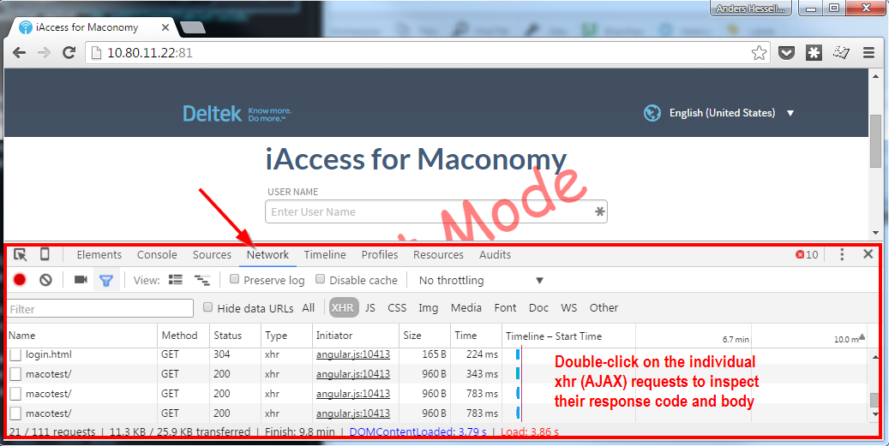

# Miscellaneous

The following section contains a migration guide which describes how to migrate a customized iAccess installation. We also include a troubleshooting guide with a few tips about how to overcome typical installation issues.

## Migration Guide

The following sections describes the steps needed for migrating from one specific version of iAccess to another. If the version that you are currently using is not mentioned here, or if you have received a special release or hotfix, please get in touch with the iAccess development team for further instructions.

Our long term goal in iAccess 2 is to make all migrations automated through tool support in the Maconomy Extender. However, this functionality is not yet available. Hence, manual steps are always required. When migrating iAccess 2 extensions, it is important to notice that such migrations have two dimensions:

1. If the Maconomy backend has changed version then the standard iAccess configuration files will most likely be extracted from a different iAccess application. In that case, it is important to inspect the differences between the source iAccess application and the target one since fields, layout, workspaces, and available configurations may have changed. The easiest way to do this is to use a Diff tool to compare the old standard files with the new ones. These standard files are always placed in the `Web` folder in `MaconomyDir` on the Maconomy server.
2. Since iAccess uses Agile methodology (with frequent smaller releases), the configuration API often changes. The API version is specified in the manifest of the iAccess FPU. This version should match the one given in the `application.json` root configuration file. When the API changes, it is important to validate one's existing extensions in the context of the target iAccess FPU. This can be done through the validation facility in the Maconomy Extender.

### From 2.2 to 2.2.3

### Changes To Menu Configuration

Two non-backward compatible changes have been introduced to the subsection of the configuration that deals with the menu.

The `defaultWorkspace` property was used to specify the workspace iAccess should load on login. This property has been de-supported and must be removed from all menus.

The `condition` property on groups and items in the menu has been replaced by the `visible` property as part of the introduction of a more general-purpose expression language. Previously, the visibility of groups and items could be guarded by either simple true/false expressions or lists of role names. The new `visible` property is a string containing an expression. If the expression evaluates to true, the group or item is made visible. Otherwise, it will be hidden. This expression can rely on system parameters and similar environment information, and has greater expressiveness than those used in previous versions.

Here is an example of how a conditional menu group must be rewritten to comply with the new syntax.

From

    "groups": [
     {
       "T$title": "Time & Expense",
       "condition": ["iaccess t&e", "iaccess_manager"],
       "items": [
        {
           "T$title": "Weekly Time Sheet",
           "workspace": "WeeklyTimeSheets"
        },

To

    "groups": [
     {
       "T$title": "Time & Expense",
       "visible": "hasRole('iAccess T&E', 'iAccess Manager')",
       "items": [
        {
           "T$title": "Weekly Time Sheet",
           "workspace": "WeeklyTimeSheets"
        },

#### Style Property Renamed To Css

With the introduction of traffic lighting and dynamic styles, the existing `style` property has been renamed to `css`. This applies across all layouts. Here is an example of how to migrate part of a layout.

From

    "columns": [
      {
        "ref": "EntryText",
        "text": {
          "T$title": "Total"
        },
        "style": {
          "border-right": "1px solid transparent",
          "font-weight": "bold",
          "Text-align": "right"
        }
      },

To

    "columns": [
      {
        "ref": "EntryText",
        "text": {
          "T$title": "Total"
        },
        "css": {
          "border-right": "1px solid transparent",
          "font-weight": "bold",
          "Text-align": "right"
        }
      },

### From 2.1 to 2.2

#### Update Foreign Key Definitions

If you created iAccess custom layouts specifically for Maconomy 2.4.0 and are upgrading to iAccess 2.2 (which requires you to run Maconomy 2.4.1 in the backend), you need to update your customizations according to the new naming conventions.

Update your custom usage of named references (that is, foreign key definitions) according to the following list of changed names:

**Dialog: Approve Expense Sheets By Employee**

    Old: "Table_ExpenseSheetHeader"
    New: "Table_CopyFromExpenseSheetNumber_ExpenseSheetHeader"

    Old: "ApprovalRelationInstanceKey_ExpenseSheetHeader"
    New: "Table_ExpenseSheetHeader"

    Old: "ExpenseSheetHeaderEmployeeNumberVar_Employee"
    New: "Table_Employee"

    Old: "SuperiorEmployee_Employee"
    New: "Table_SuperiorEmployee_Employee"

    Old: "SecretaryEmployee_Employee"
    New: "Table_SecretaryEmployee_Employee"

    Old: "TutorEmployee_Employee"
    New: "Table_TutorEmployee_Employee"

    Old: "ApprovalGroupInstanceKey_ApprovalGroup"
    New: "Table_ApprovalGroup"

**Dialog: Approve Purchase Order Lines By Employee**

    Old: "ApprovalLine_PurchaseOrderLine"
    New: "Table_PurchaseOrderLine"

#### Introduction of Action Groups

Previous to this release, all actions were shown in a drop-down list called "Other actions". Actions are now shown on a line together with "Save" and "Revert". The following example:

```
{
  ...
  "actions": [
    {
      "title": "Submit",
      "source": "SubmitTimeSheet"
    },
    {
      "title": "Submit",
      "source": "SubmitTimeSheet"
    }
  ]
  ...
}
```

Renders actions as:

```
Save | Revert | Submit | Reopen
```

You can also make action groups. This means you can have one or more groups of actions next to the row of action buttons.

```
{
  ...
  "actions": [
    {
      "title": "Submit",
      "source": "SubmitTimeSheet"
    },
    {
      "title": "Submit",
      "source": "SubmitTimeSheet"
    },
    "actions": [
      {
        "title": "Print",
        "source": "PrintTimeSheet"
      },
      {
        "title": "Copy From",
        "source": "CopyTimeSheet"
      }
    ],
    "title": "Even more actions",
    "actions": [
      {
        "title": "Extra action"
        ...
      },
      {
        "title": "Extra action 2"
        ...
      }
    ]
  ]
  ...
}
```

Renders actions as:

```
Save | Revert | Submit | Reopen | Other actions | Even more actions

                                  Print           Extra action
                                  Copy From       Extra action 2
```

If you leave out "title" for an action group, the group is labelled "Other actions" by default.

### From 2.1 to 2.1.1

#### Reusable info-bubbles

You need to manually update all custom reusable info-bubbles.

The format for the __parameters__ atribute, found in the info-bubble definition, is updated.

From:
```
{
  "parameters": [
    fieldName1,
    fieldName2,
    ...
  ],
  ...
}
```

To:

```
{
  "parameters": {
    "fields": [
      fieldName1,
      fieldName2,
      ...
    ]
  },
  ...
}
```

### From 2.0.x to 2.1

iAccess 2.1 includes the parameterized workspace panes feature, a functionality that introduces a breaking change in workspace and container configurations.

#### Workspace Definition

You need to manually update all custom workspaces.

The format for the __parameters__ attribute-found under the __container__ definition in the dataBindings section of the workspace-is updated

From:

    {
      urlParameterName: fieldName,
      ...
    }

To:

    {
      fieldName: parameterObject,
      ...
    }

where `parameterObject` can be a URL parameter definition or an expression parameter definition.

1\. URL parameter

    {
      "urlParameter": name
    }

where `name` is a string with the name of the parameter that will be used in the URL.

2\. Expression parameter

     {
       "expression": expression
     }

where `expression` is a string with the Expression Language expression providing the value for the parameter. The expression may refer to fields in any pane of the workspace, except for the pane where this parameter is defined as well as this pane's descendants.

For example, the `WeeklyTimeSheets.json` file contained the following lines:

    {
      "date": "DateVar",
      "EmployeeNumber": "EmployeeNumberVar"
    }

After the update, this is now converted to:

    {
      "DateVar": {
        "urlParameter": "date"
      },
      "EmployeeNumberVar": {
        "urlParameter": "EmployeeNumber"
      }
    }

#### Layout Definition
Some ___breaking changes___ are applied to the layout definitions.

1\. Label is renamed to text. This means that all instances of `label` elements must be changed to `text` elements.

    {
      "label: {
        "template": "Some string"
        ...
      }
      ...
    }

must be changed to

    {
      "text: {
        "template": "Some string"
        ...
      }
      ...
    }

2\. Action rows have been removed. Previously, you could add a row of actions anywhere in the layout. Now, you can only add actions to the top of the layout or in a tab.

A `record` element can now be added to the top of the layout. This can be thought of as the heading defining the shown entity. In the following example, the `title` defines week information for the time sheet, and the `subTitle` defines employee information. The `status` shows the status of the time sheet, and the `actionBar` contains the actions.

    "layout": {
      ...
      "record": {
        "pane": "TimeRegistrationCard",
        "T$title" : "Week ^{WeekNumberVar}^{PartVar}: ^{PeriodStartVar} - ^{PeriodEndVar}",
        "subTitle": {
          "reference": {
            "description": "EmployeeNameVar",
            "key": "EmployeeNumberVar"
          }
        },
        "status": {
          "source": "SelectedTimeSheetStatusVar",
          ...
        },
        "actionBar": {
          ...
          "actions": [
            {
              "source": "SubmitTimeSheet",
              ...
            }
            ...
          ]
        }
      }
      ...
    }

Actions can be added to the tabs as shown in the following example:

    {
      ...
      "tabs": [
        {
          "T$title": "Expense Sheets",
          ...
          "actions": [
            {
              "source": "ApproveExpenseSheetsByEmployeeCard.ApproveAll"
            }
          ]
          ...
        }
      ]
      ...
    }

#### Container Definition

This functionality also introduces a breaking change in the container configuration (`Containers.json`).

The `singleton` attribute under the `card` pane configuration is now replaced by three attributes:

* `singletonIdentifiers` - This maps field names in the card pane to REST API identifiers, such as *card.datevar*.
* `stateParameters` - This lists the fields in the card pane of this container that do not persist on the server side, and thus need to be maintained on the client side.
* `navigationParameters` - This lists the fields in the card pane of this container that control the internal navigation in the card and the table. These fields cannot be changed at the same time as other fields in the card or table panes.

### From 1.x to 2.0

You need to redo all extensions from scratch. We are not delivering a migration tool at this point. Deltek recommends that you inspect the standard extensions delivered with iAccess 2.0, and then ask concrete questions in our "iAccess for Maconomy" Kona space (https://www.kona.com/#!/projects/129727). Engineering is actively monitoring this forum to ease the transition.

Please observe that for 2.0, two new rewrite rules are added for the two new REST endpoints that we rely on, specifically "auth" and "environment". On IIS, an additional rewrite rule is required as described in the "Edit Routing Rules" section. Also, you need to configure "woff2" as a supported MIME type.

### From 1.2.x and 1.3.0-3 to 1.3.4

For upgrades from the 1.2.x series, perform the steps outlined in the following sections, and then proceed to the step given here.
When migrating from 1.3.0-3 versions to 1.3.4, make sure you update all JSON references. You no longer need to include an iAccess namespace in the names of specification files. This means you should remove the `iaccess:`-prefix from JSON references.
For example, change:

    "screens": {
      "dm.dailytimesheets": {
        "$ref": "iaccess:dailytimesheets"
      }

to

    "screens": {
      "dm.dailytimesheets": {
        "$ref": "dailytimesheets"
      }


### From 1.2.0 and 1.2.1 to 1.2.2 and 1.3.0

Some of our core terminology has changed, as outlined in the following table. This means that you need to update the following keys in your configuration:

| User Interface Concept | 1.2.0 and 1.2.1 API | 1.2.2 and 1.3 API |
|------------------------|---------------------|-------------------|
| Default View           | `defaultScreen`     | `defaultView`     |
| Views                  | `screens`           | `views`           |
| Leftnav                | `sidebar`           | `leftnav`         |

Since this is a *breaking change*, the API version has also changed. Configurations should state that they now rely on version `2.0.0` rather than `1.2.0`.

In 1.3, we added support for the Additional Table Fields extension point in expense and mileage sheets. This means you must merge the specifications from these views with the new defaults from the iAccess 1.3 FPU. You can use the Maconomy Extender to assist in this process.

We also added some new parts to the configuration. Integrate these changes by importing the latest specifications from a new FPU and merging these with existing customizations. Specifically, we introduced a `documentationUrl` under the `configuration` section in `application.json`. In this section, we also introduced references to two new specification files: `authentication.json` and `usagetracking.json`. Use the Maconomy Extender to add these files.

When migrating to `1.2.2` or to `1.3.0`, remove the preferences in the following listing from the `preferences.json` file. The defaults have changed and are not valid anymore. Customize the preferences as described in the configuration section.

	"dateFormat": {
     "short": "M/d/yyyy"
	},
	"decimalSymbol": ",",
	"digitGroupingSystem": ".",
	"minutesThreshold": 10

### From 1.1.x to 1.2.x

The major difference between the 1.x versions and 1.2.x is the introduction of the extensibility model. The table in the next section describes which configuration options from 1.2.x replace deprecated configuration options from 1.1.x.

#### Configuration of Leftnav

In version 1.1.x, you could configure which views were accessible via the leftnav by changing the `this.sidebarItems` array in `config.js`. This was done after installation on each individual web server.

In version 1.2.x, this kind of configuration is now a part of the central view configuration, and managed via the Maconomy Extender. You can access the configuration of each view by following the links from `application.json` file. To show/hide a particular view, set the `enabled` attribute to either `true` or `false`.


    {
      "name": "dm.dailytimesheets",
      "enabled": "true",
      ...
    }


The mapping of view names between version 1.1.x and 1.2.x can be found in the following table:

| 1.1.x View Name           | 1.2.x View Name     |
|---------------------------|---------------------|
| inside.timesheets         | dm.weeklytimesheets |
| inside.dailytimesheets    | dm.dailytimesheets  |
| inside.expensesheets.edit | dm.expensesheets    |
| inside.mileagesheets.edit | dm.mileagesheets    |
| inside.jobfavorites       | dm.favoritemgmt     |
| inside.absence.tabs       | dm.absencemgmt      |

In version 1.1.x, you could specify the default leftnav tab in `config.js` with the `defaultSidebarItem` property. In version 1.2.x, you specify the default leftnav in the beginning of the `application.json` configuration as shown in the following example:

    {
      "api": "1.2.0",
      "defaultScreen": "dm.weeklytimesheets",
      "screens": ...
    }

#### Configuration of the Weekly Time Sheets View

In version 1.1.x, you could configure two properties of the time sheets' views: daily descriptions, and overtime specification.

In weekly timesheets, you could enable or disable daily descriptions
in `config.js` by setting the `isDailyDescriptionsEnabled` property to either true or false. In version 1.2.x, you achieve this configuration by using the extension point `dm.additionalTableFields` described in a previous section.

Finally, in version 1.1.x, you could show or hide the overtime specification in weekly time sheets. In version 1.2.x, you achieve this by adding the `overtimetype` field to the table using the extension point `dm.additionalTableFields` described in a previous section.

#### Localization

In version 1.1.x, you localized a subset of the terms (for example, error messages) by placing a custom iAccess dictionary in the `i18n` folder on each web server. The 1.1.x version was only released with dictionaries for English and Danish. In version 1.2.x, all localization takes place on the Maconomy server through the existing localization engine. You customize translations by editing the traditional Maconomy dictionaries on the Maconomy server.

## Troubleshooting Guide

Solutions to common installation issues are found in the [Installing iAccess](#installing-iaccess) section. If your issue/problem is not listed there, the following section provides some additional clues to solve common issues. If you still cannot find a solution to your specific problem, please post a conversation in the *iAccess for Maconomy* Kona space or raise a support case through Customer Care to get your concrete issue resolved.

A piece of general advice for technical consultants: Always take a look at the requests that the browser issues when you are getting installation and/or network problems. In particular, the AJAX requests and error responses are often useful for uncovering installation and configuration errors. Figure @chrome shows Developer Tools in Chrome where the Network Tab can be a very powerful tool to uncover installation and network problems.



#### "*Incompatible API versions...*"-Error

The iAccess specification format deployed on the Maconomy server is not compatible with the installed version of iAccess. This error usually occurs because either the `application.json` specification or the iAccess installed on a given web server have not been updated as part of a system upgrade. If the lowest number in the error message is the *required API version*, then you need to upgrade the iAccess version installed on the given web server. This requires the use of MConfig.

If the lowest number is the *loaded specification API version*, then update the specification deployed to the Maconomy server. This requires the Maconomy Extender.

#### "*Bad Request: Unable to connect to 'configurations' endpoint...*"-Error

When moving from version 1.1.x to 1.2.x, iAccess becomes dependent on a new webservice called *configurations*. This web service has to be available through the proxy configuration on the web server. This is similar to how the *containers* and *filedrop* web services are setup. See the [Installing iAccess](#installing-iaccess) section for details.

Even if you have properly configured the *configurations* endpoint, you may still get the error on certain IIS installations. The problem can then be that some IIS installations do not allow the colon `:` character in URLs. To solve this, allow the colon `:` in the `web.config` file in the root of your web server [@IISColons]. Use its unicode encoded format `%u003a` in the configuration.

    <configuration>
      <system.web>
      <!-- Default <,>,*,%,&,:,\,?
                or %u003c,%u003e,%u002a,%u0025,%u0026,%u003a,%u005c,%u003f -->
        <httpRuntime
           requestPathInvalidCharacters="%u003c,%u003e,%u002a,%u0025,%u0026,%u005c,%u003f" />
      </system.web>
      <system.webServer>
        ...
      </system.webServer>
    </configuration>

#### "*A%20Network%20Error%20Occurred*"-Window Opens

This error occurs when HTTPS has been partially or incorrectly configured on the web server. Double-check that the web server is configured according to the steps in the [Installing iAccess](#installing-iaccess) section. This includes checking that the OSGi products in MConfig are configured correctly, and that HTTPS forwarding rules are set up on the web server.

#### Error 500 in the Browser on Apache 2.2 Installations

If you get a 500 error code in the browser and the following message in the Apache error log: `configuration error: couldn't perform authentication. AuthType not set!: /`, the cause is an incorrect `vhosts.conf` file. Specifically, make sure that the line `Require all granted` is not present. This problem occurs for Apache 2.2 only. Apache 2.4 requires this line.
